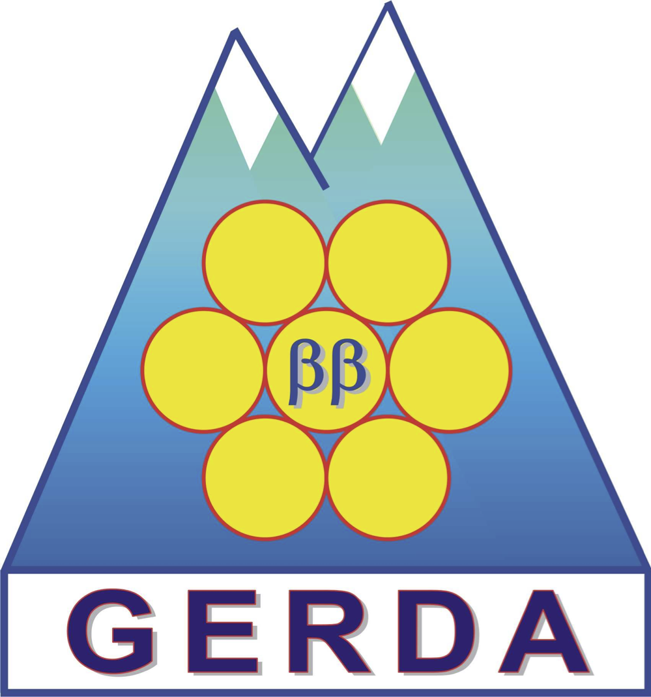

  <h1>gerda-mage-sim  </h1>

The aim of this repository is to provide a mirror (without actual data files) of the `/nfs/gerda5/var/gerda-simulations/gerda-mc2` folder at LNGS cluster containing official Monte Carlo simulations of background contaminations for GERDA Phase II. It can be easily browsed to check the current status of the simulations (what has been simulated and what has not) and inspect the MaGe macro files. The repository is filled with READMEs reporting all valuable informations for the sake of reproducibility.

Refer to the [Wiki page](https://github.com/mppmu/gerda-snippets/wiki/MaGe-simulations-stored-at-LNGS) for further documentation. [Here](https://github.com/mppmu/gerda-snippets/tree/master/MaGe-macros) you find a reference macro file for MaGe.

Mantainers:
* Katharina von Sturm - [vonsturm@pd.infn.it](mailto:vonsturm@pd.infn.it)
* Luigi Pertoldi - [luigi.pertoldi@pd.infn.it](mailto:luigi.pertoldi@pd.infn.it)

### Useful links
* [Documentation](https://github.com/mppmu/gerda-snippets/wiki/MaGe-simulations-stored-at-LNGS)
* [How to add your contribution](https://github.com/mppmu/gerda-snippets/wiki/MaGe-simulations-stored-at-LNGS#add-your-contribution-to-the-official-repository-by-running-simulations-on-your-cluster)
* [`UTILS/`](https://github.com/gipert/gerda-mage-sim/tree/master/UTILS): Command Line Tools used in the context of this repository
* [Germanium detectors sampled surfaces](https://github.com/gipert/gerda-mage-sim/tree/master/gedet/surf/ver)
* [MaGe source code repository](https://github.com/mppmu/MaGe)
