# Crosscheck of isotopes in Geant4 and decay0 primary generation

## Isotopes

* [Ac228](#ac228)
* [K40](#k40)
* [K42](#k42)
* [Tl208](#tl208)
* [Co60](#co60)
* [Pa234m](#pa234m)
* [Bi207](#bi207)
* [Kr85](#kr85)
* [Pb214](#pb214)

## Ac228

  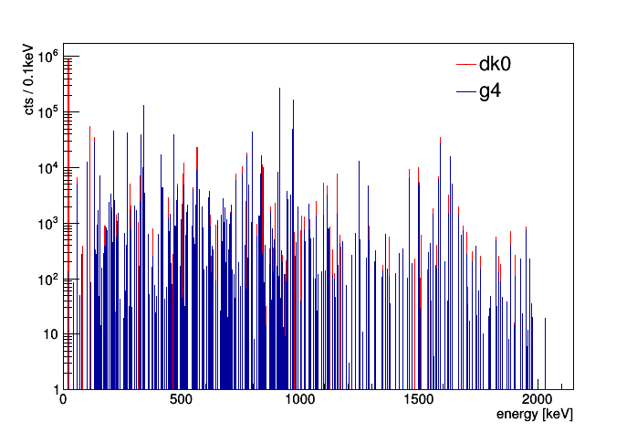
  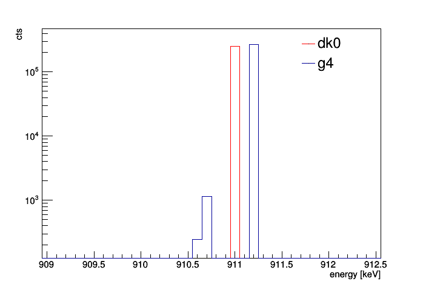

* Lines of G4RadioactiveDecay in accordance with recommended data
* Do not use decay0 to generate the primaries

## K40

  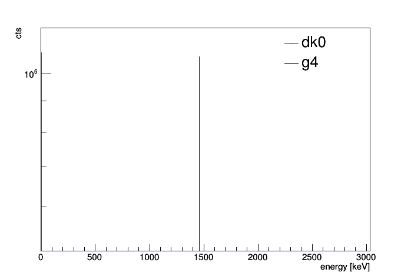
  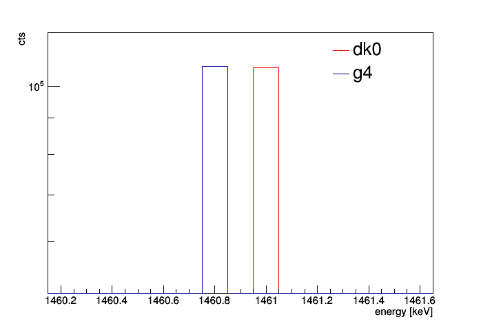

* Lines of G4RadioactiveDecay in accordance with recommended data
* Do not use decay0 to generate the primaries

## K42

  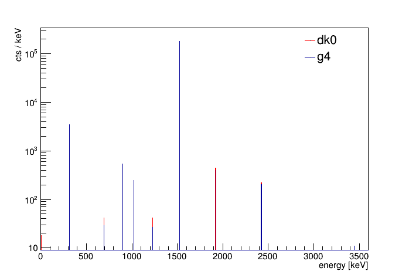
  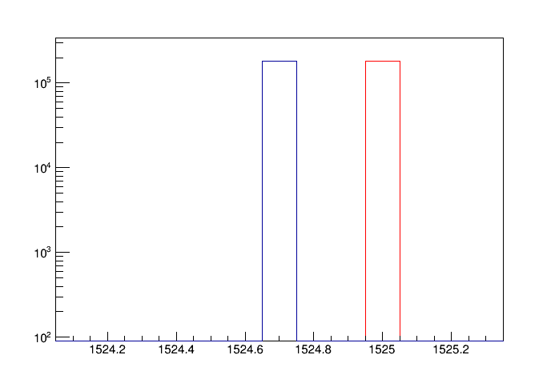

  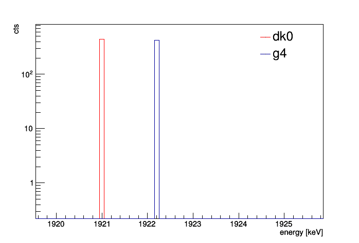
  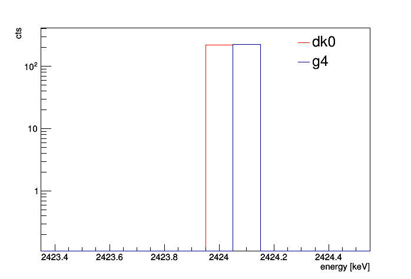

  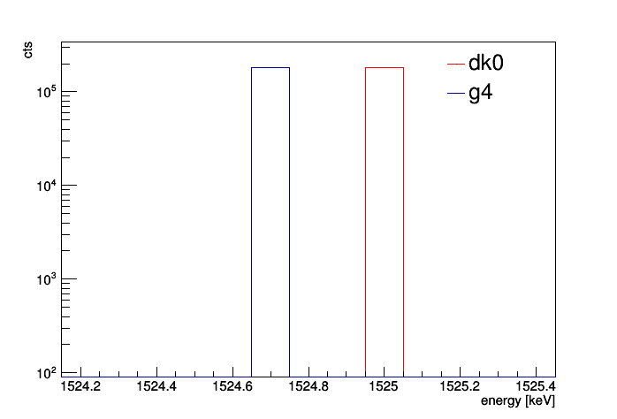
  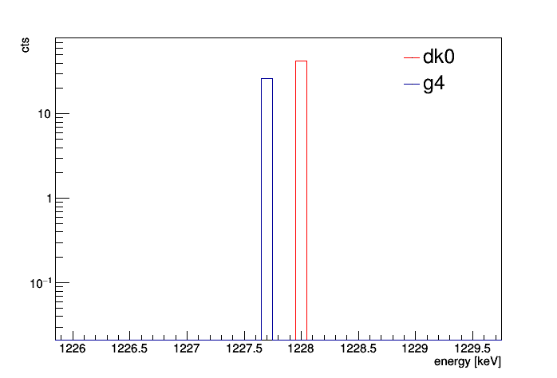

  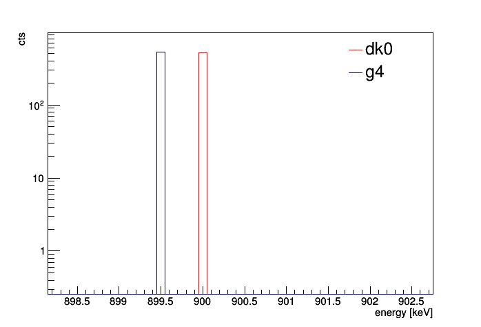
  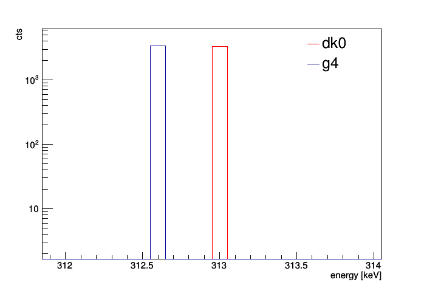

* None of the two primary generators is really in accordance with NuDat

312.60 (25)  0.336  
692.0   (8)  0.0033  
899.7   (4)  0.052  
1021.2  (9)  0.0201  
1228.0 (15)  0.0024  
1524.6  (3) 18.08  
1920.8 (10)  0.041  
2424.3  (7)  0.020  

## Co60

  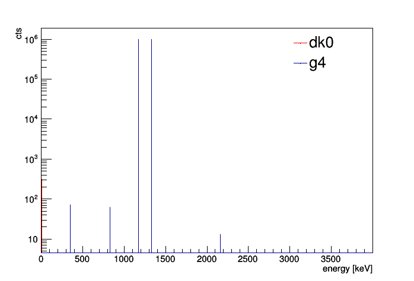
  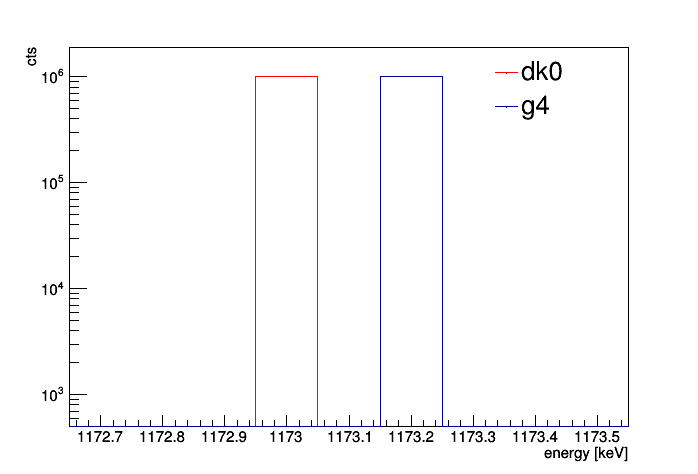

  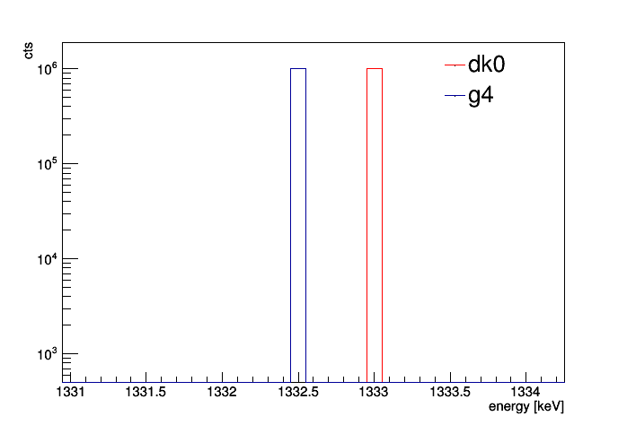
  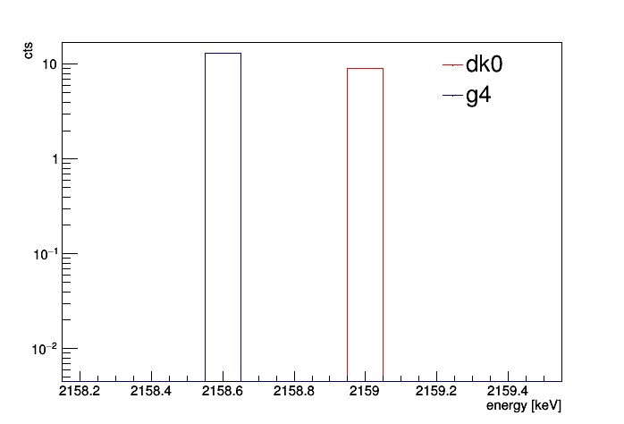

* Lines of G4RadioactiveDecay in accordance with recommended data
* Do not use decay0 to generate the primaries

## Tl208

  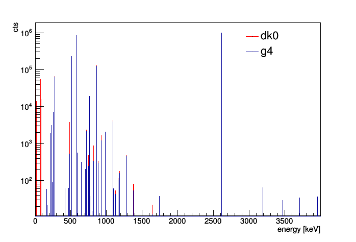
  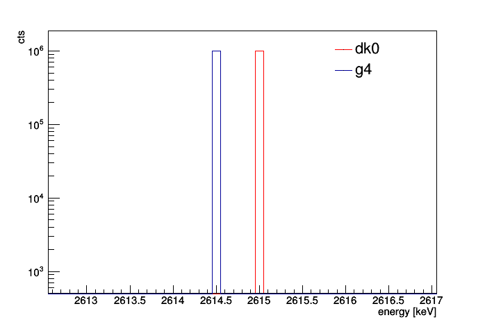

  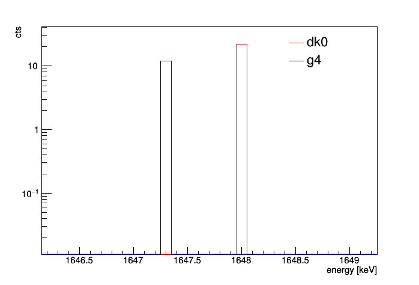

* Lines of G4RadioactiveDecay in accordance with recommended data
* Do not use decay0 to generate the primaries

## Kr85

## Pb214

## Pa234m

  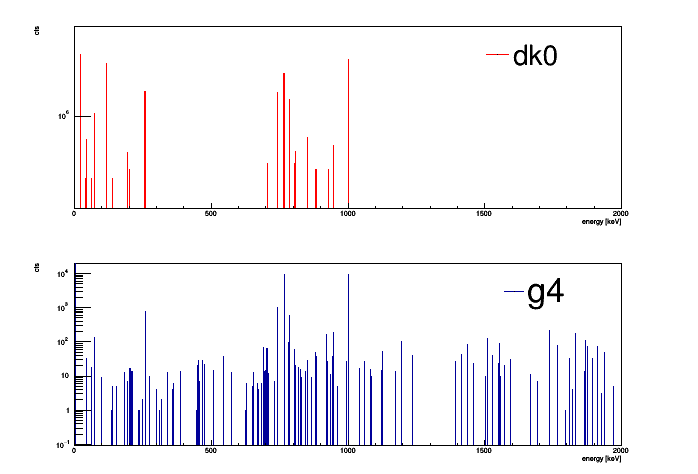
  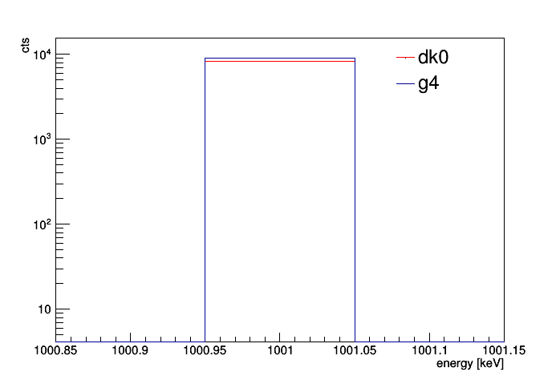

  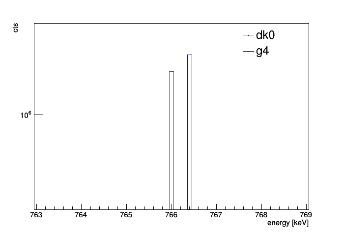

* Lines of G4RadioactiveDecay in accordance with recommended data
* decay0 is missing many lines 

## Bi207

  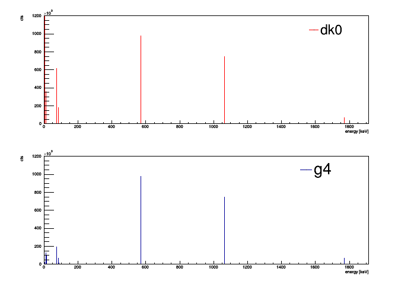
  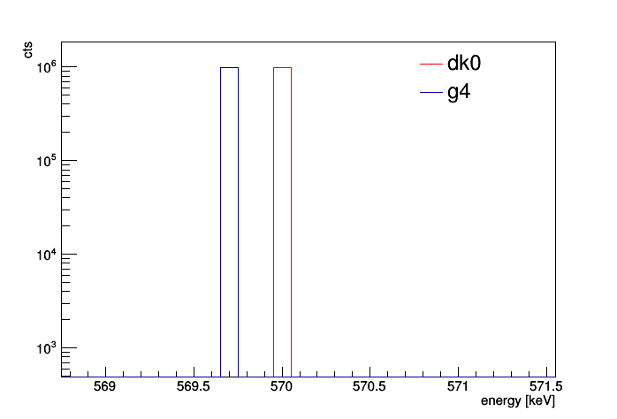

  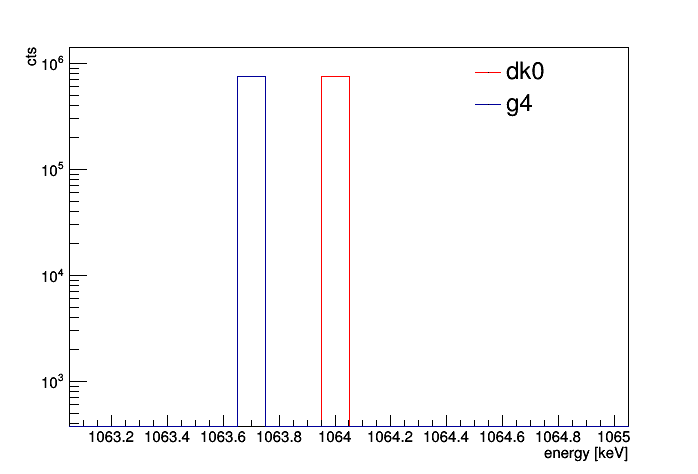

* Lines of G4RadioactiveDecay in accordance with recommended data
* Do not use decay0 to generate the primaries
* Pb207 13/2+ 1633.368 level has a lifetime of 0.8s and is killed by a hack in MaGe

## Macro

For the simulation the Dario detector and rootscheme was used

/tracking/verbose                               0 
/MG/manager/mglog                               trace 
/MG/manager/seedWithDevRandom 
/MG/processes/realm                             BBdecay 
/MG/processes/lowenergy                         true 
/MG/processes/useNoHadPhysics                   true 
/MG/geometry/detector                           Dario 
/MG/geometry/database                           false 
/MG/eventaction/reportingfrequency              10000 
/MG/eventaction/rootschema                      Dario 
/MG/eventaction/rootfilename               	    Out_Dario.root 

/run/initialize 

/MG/generator/confine                           volume 
/MG/generator/volume                            crystal 
/MG/generator/select                       	    decay0 
/MG/generator/decay0/filename             	    decay0files/K42_1E7.dk0 
/tracking/verbose                          	    0 
/run/beamOn                                	    1000000 

