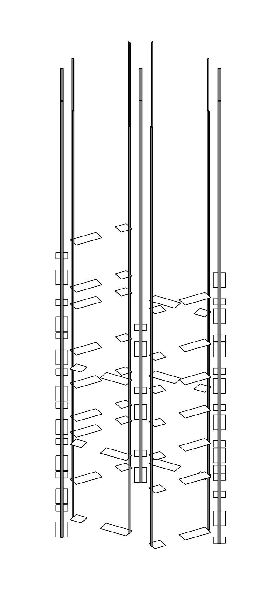

# cables

## volumes description

| volume name    | mc name(s)                                               | mc mass [g] | mc volume [cm^3] | density [g/cm^3] | volume description | notes |
| -------------- | -------------------------------------------------------- | ----------- | ---------------- | ---------------- | ------------------ | ----- |
| hv_at_holders  | `HVCableAtHolder_Phase2 [0..39]`                         | 1.82070     | 1.19             | 1.53 (kapton)    | high voltage cable patch at holder plate |       |
| sig_at_holders | `SignalCableAtHolder_Phase2 [0..39]`                     | 4.31766     | 2.822            | 1.53 (kapton)    | signal cable patch at holder plate |   |
| hv_cables      | `HVCableFromHolderToElectronicsPlate_Phase2 [0..39]`     | 12.43250    | 8.125817         | 1.53 (kapton)    | high voltage cable body from holder up to electronics plate |    |
| sig_cables     | `SignalCableFromHolderToElectronicsPlate_Phase2 [0..39]` | 12.43250    | 8.125817         | 1.53 (kapton)    | signal cable body from holder up to electronics plate |       |

A picture of the four volumes put together:

  

