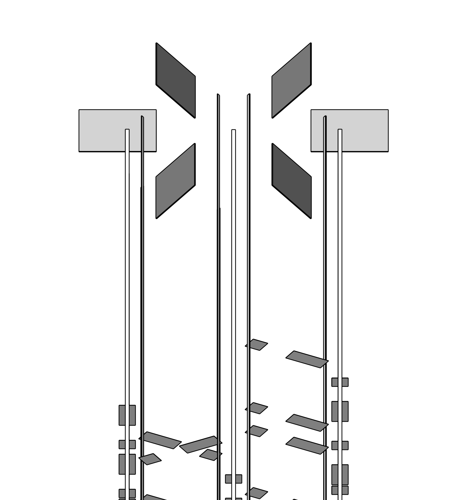

# electronics

## volumes description

| volume name | mc name(s)             | mc mass [kg] | mc volume [cm^3] | density [kg/cm^3] | volume description | notes |
| ----------- | ---------------------- | ------------ | ---------------- | ----------------- | ------------------ | ----- |
| cc3         | `CC3_Physical [0..5]`  | 0.05196      |                  |                   | Front end electronics above the array |       |

A picture of all the cc3:

  

