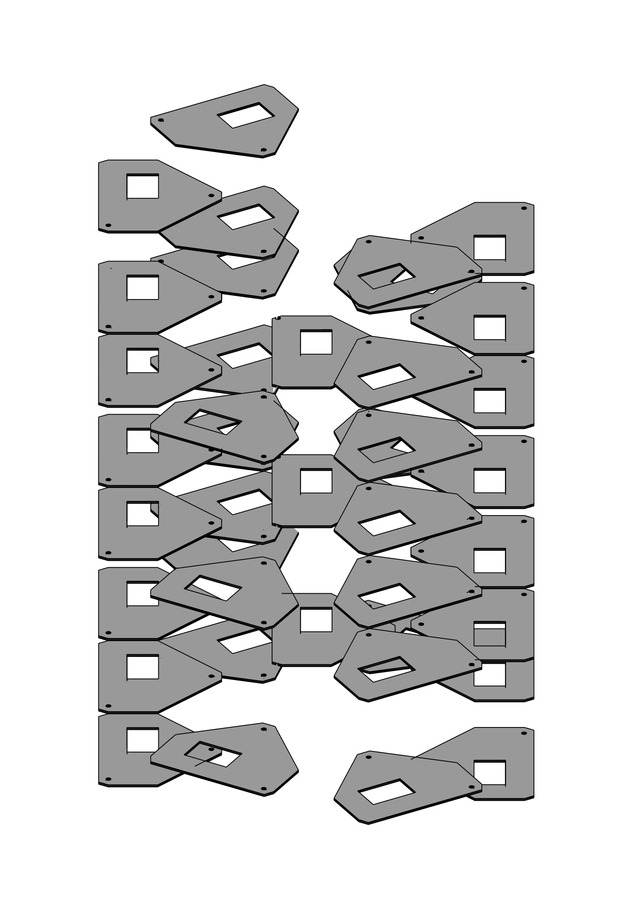

# ge_holders

## volumes description

| volume name | mc name(s)             | mc mass [kg] | mc volume [cm^3] | density [g/cm^3] | volume description                              | notes |
| ----------- | ---------------------- | ------------ | ---------------- | ---------------- | ----------------------------------------------- | ----- |
| plates      | `Holder_Plate [0..39]` | 0.659134     | 0.282891         | 2.33             | Silicon plates that sustain germanium detectors |       |

A picture of all the holder plates:

  

