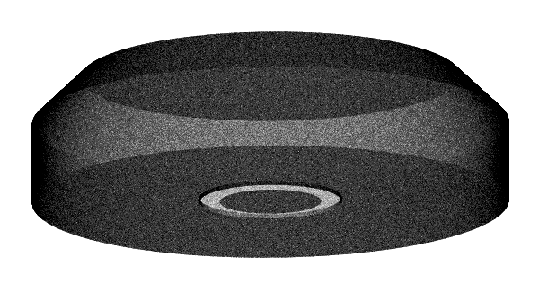
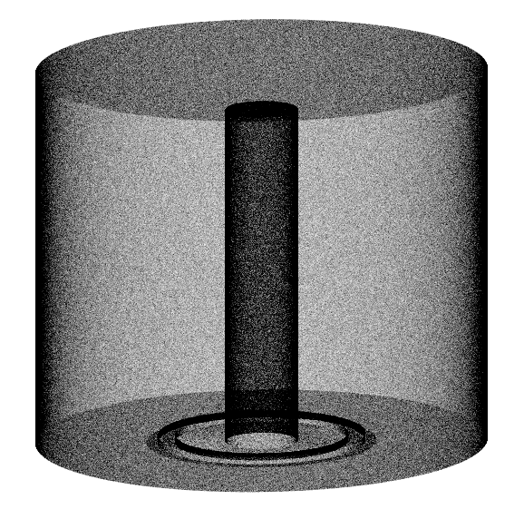

# gedet/surf/ver
Vertices for `surf` simulations are placed here, corresponding macro files can be found under `log/`. As Geant4 does not efficiently sample complex surfaces (especially boolean solids) the Generic Surface Sampler (GSS) is used. The resulting vertices are stored as (x,y,z) coordinates in a ROOT file. For further informations see [the MaGe user-guide](https://github.com/mppmu/gerda-snippets/blob/master/MaGe-macros/MaGe-userguide.pdf) at §6.11.2.

The simulations are further processed to extract p+ and n+ surfaces under `gedet/pplus/ver` and `gedet/nplus/ver/`.

## simulations info

| contact     | primaries                           | MGDO branch/commit      | MaGe branch/commmit            | containers     | notes |
| ----------- | ----------------------------------- | ----------------------- | ------------------------------ | -------------- | ----- |
| L. Pertoldi | O(1E06), but vary for each detector | `clhep_2.3.3.1/cece4fe` | `GERDAPhaseII-Dec2017/9fe03ca` | `g4.10.3_v2.0` | Macros are auto-genereted by the `UTILS/surf-sampling/create-surf-macros.jl` script |

To get the actual number of events for each file you can run the following command into this folder:
```shell
$ root << EOF
          TFile * file;
          cout << "channel\tentries\n";
          for ( int i = 0; i < 39; ++i ) {
              file = TFile::Open(Form("ver-gedet-surf-ch%i.root", i));
              cout << i << '\t' << GSSTree->GetEntries() << '\n';
          }
EOF
```

## Comments
These samplings were originally produced only for the n+ and p+ contacts extraction, if you want to use them directly for simulations over the complete detector's surface you must be aware of some details.

While the coaxials are efficiently sampled all over their surface, groove hole included, this is not the case for BEGEs. In BEGe detectors the groove hole is sampled only in a minimal part (partly visible in the picture). To obtain the complete groove hole you must also perform an independent sampling of the surface between the active volume (`Crystal_geometry$ID`) and the LAr (`CryoLiquidPhysical`) and then merge it coherently with these simulations.

<p align="center">
  
  
</p>
