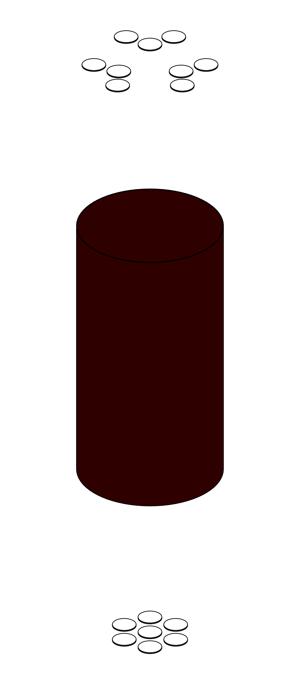

# larveto

## volumes description

| volume name            | mc name(s)                                                                      | mc mass [kg]        | mc volume [cm^3] | density [g/cm^3] | volume description                                                                    | notes |
| ---------------------- | ------------------------------------------------------------------------------- | ------------------- | ---------------- | ---------------- | ------------------------------------------------------------------------------------- | ----- |
| fibers (non segmented) | `LArInstr_FiberOuter_Physical`                                                  | 1.36146             | 1296.629         | 1.05             | Cylinder (without top and bottom) around Ge array                                     |       |
| sipm_ring (segmented)  | `LArInstr_FiberOuter_SensitiveEnd_Physical [0..14]`                             | 0.00336289          | 1.4433           | 2.33             | Ring on the top of fiber shroud (where SiPMs are placed)                              |       |
| pmt_top                | `LArInstr_PMTGlassPhysical [0..8]`                                              | 0.307004            | 139.547          | 2.2              | Bases of the PMTs over the top of the fiber shroud at the end of the PMT housings     |       |
| pmt_bottom             | `LArInstr_PMTGlassPhysical [9..15]`                                             | 0.238781            | 108.537          | 2.2              | Bases of the PMTs under the bottom of the fiber shroud at the end of the PMT housings |       |
| copper_shroud          | `LArInstr_VM2000CylinderPhysical_top`, `LArInstr_VM2000CylinderPhysical_bottom` | 2 x 0.792 = 1.58443 | 1760.477         | 0.9              | Copper shroud at top and bottom of the fiber shroud                                   |       |

A picture of the volumes put together: fibers (non-segmented), sipm_ring (segmented), pmt_bottom and pmt_top:

  

