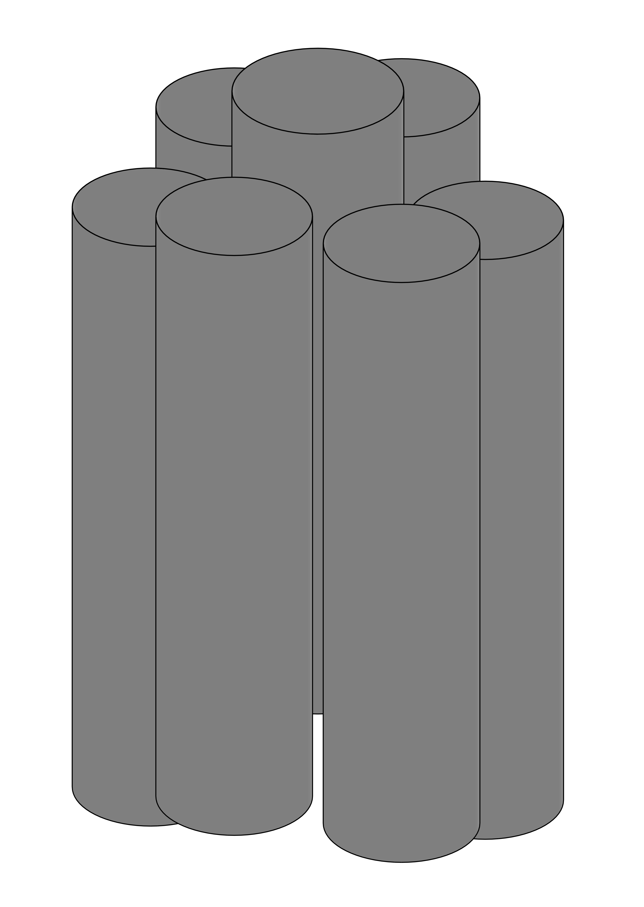
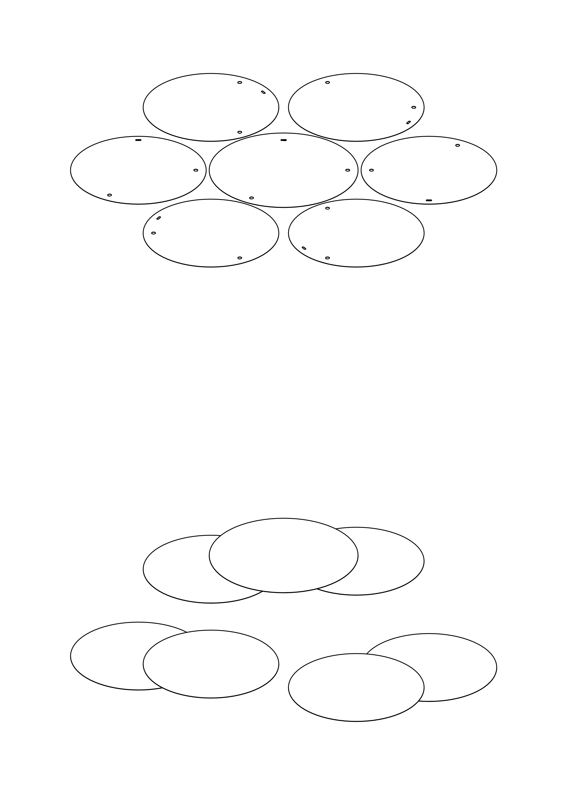
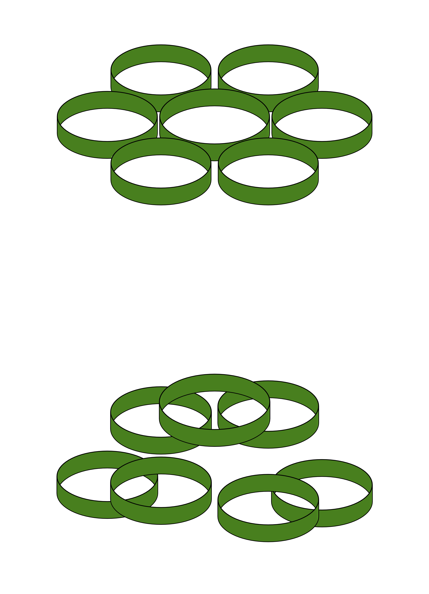
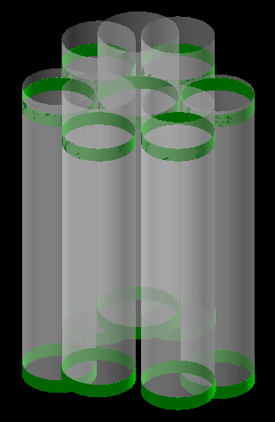

# minishroud
**Remember to update also `UTILS/sim-parameters-all.json`**

## volumes description

| volume name               | mc name(s)                                                            | mc mass [kg] | mc volume [cm^3] | density [g/cm^3] | volume description                                                                          | notes |
| ------------------------- | --------------------------------------------------------------------- | ------------ | ---------------- | ---------------- | ------------------------------------------------------------------------------------------- | ----- |
| ms_all                    | `MiniShroudPhase2[Top,Bottom,Tub,BottomGluedRing,TopGluedRing] [0..6]`| 0.188602     | 164.0017         | 1.15 (nylon)     | All minishrouds, all five components: top, bottom, tub, glue_ring_bottom, glue_ring_top (7) |       | 
| ms1                       | `MiniShroudPhase2[Top,Bottom,Tub,BottomGluedRing,TopGluedRing] 0`     | 0.0293738    | 25.54243         | 1.15 (nylon)     | Minishroud 1, all five components: top, bottom, tub, glue_ring_bottom, glue_ring_top (7)    |       |
| ms[2-7]                   | `MiniShroudPhase2[Top,Bottom,Tub,BottomGluedRing,TopGluedRing] [1-6]` | 0.0265386    | 23.07704         | 1.15 (nylon)     | Minishroud 2-7, all five components: top, bottom, tub, glue_ring_bottom, glue_ring_top (7)  |       |
| glue_rings_all            | `MiniShroudPhase2[BottomGluedRing,TopGluedRing] [0..6]`               | 0.0263782    | 22.93756         | 1.15 (nylon)     | All minishroud's glue_rings, top and bottom (7)                                             |       |
| glue_ring1                | `MiniShroudPhase2[BottomGluedRing,TopGluedRing] 0`                    | 0.00407798   | 3.546070         | 1.15 (nylon)     | Minishroud 1's glue ring, top and bottom (7)                                                |       |
| glue_ring[2-7]            | `MiniShroudPhase2[BottomGluedRing,TopGluedRing] [1-6]`                | 0.0037167    | 3.231913         | 1.15 (nylon)     | Minishroud 2-7's glue ring, top and bottom (7)                                              |       |
| glue_ring7_bottom         | `MiniShroudPhase2BottomGluedRing_6`                                   | 0.00186512   | 1.621843         | 1.15 (nylon)     | Minishroud 7's glue ring, bottom                                                            |       |
| glue_ring7_top            | `MiniShroudPhase2TopGluedRing_6`                                      | 0.00185158   | 1.610069         | 1.15 (nylon)     | Minishroud 7's glue ring, top                                                               |       |

Some pictures: from left to right: the tubs, the tops and the bottoms, the top and bottom glue rings

  
  
  

  

